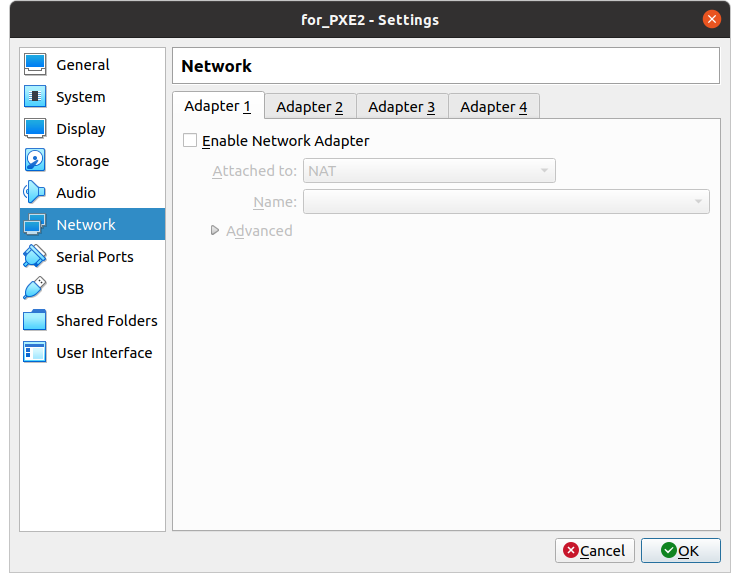
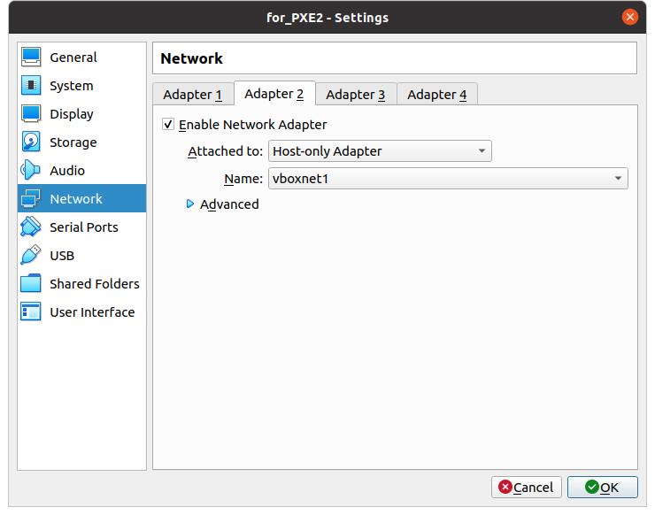
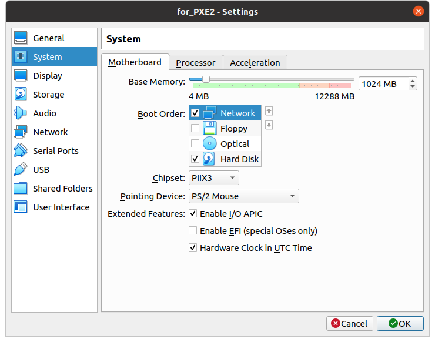

# otus_dhcp_pxe

Замечания по зупуску.

1) Надо следить, чтобы образ CentOS 8.3 скачивался полностью. У меня получался 1 раз из 4-х. Если образ не загрузится - необходимые файлы не распакуются на сервер DHCP. Минимального образа для 8.3 не существует, приходится качать все 9 ГБ. И машинки делать больше стандартных 8 ГБ.

2) Настройки виртуальной машины делал руками как на картинках.

3) DHCP ловит, инсталляция стартует. Но! на каком-то этапе пишет, что "anaconda failed to fetch stage2". Я не смог победить эту проблему. 

